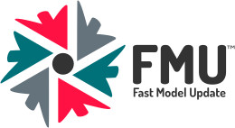

Fast Model Update is the name of a reservoir modelling methodology, which resolves major bottlenecks related to building and maintaining reservoir models, including assisted history matching with updates of geomodel parameters. FMU is not the individual steps in reservoir model building, it is more the overall framework of building a consistent, repeatable and automated model building workflow, and the usage of such models.

Reservoir characterization and model building creates a platform for reservoir management and decision making. Taking decisions based on all the available data, including uncertainty, should be the natural ambition. FMU allows for a consistent and traceable way of obtaining this information.


This live demo is using a synthetic dataset for training. Earlier we had the Reek dataset, now Drogon has arrived.
The dataset is openly available: [Drogon output test dataset](https://github.com/equinor/webviz-subsurface-testdata).
<br><br>


Webviz is designed for analysing FMU model results, i.e. multi-realization ensembles. Click on the different pages in the **Webviz Menu** to start exploring Webviz plugins! 
Note that Webviz is under heavy development - visit back regularly to check for updates or new plugins.

<br>
### The configuration file

Webviz applications are created from a high level yaml configuration file.
The configuration file used for making this live demo app is shown in *"Webviz Intro - Information - How was this made"*.

It might look long, but the idea is very simply, and as abstract as it can get:

- **Specify which "pages"** you want to appear in the menu (and with which title).
- **Specify the content** (i.e. which dashboard you want to appear) on each page.
- Each dashboard takes some (optional) arguments that you can provide if you want 
  to **override default settings**.
- Use the group keyword to organize pages in sub-sections.

Webviz will create the application for you, from the configuration file, when
you either run
```bash
webviz build your_config.yml
```
or
```bash
webviz build your_config.yml --portable ./some_output_folder
python ./some_output_folder/webviz_app.py
```
The first one will create a "live app" which reloads and updates when you change
the configuration file, the latter will create a portable app where any data aggregation
is done as a preprocessing step during the build process. If you have a large application
where data is aggregated/processed on demand (and not from e.g. some external API with
already aggregated data), you should use the latter build process such that the application
user does not need to wait for interactively requested data to be aggregated.

<br>
#### More information

Either go to the [subsurface plugin documentation](https://equinor.github.io/webviz-subsurface),
or see the following repositories for more information:

Python package                 | What is it?                                                                                | Link to GitHub repository
------------------------------ | ------------------------------------------------------------------------------------------ | ----------------------------------------
`webviz-config`                | Configuration and plugin framework, built on top of [Dash](https://github.com/plotly/dash) | <https://github.com/equinor/webviz-config>
`webviz-subsurface`            | Subsurface plugins towards `webviz-config`                                                 | <https://github.com/equinor/webviz-subsurface>
`webviz-subsurface-components` | Highly specialized subsurface React components used towards `webviz-subsurface`            | <https://github.com/equinor/webviz-subsurface-components>

  
<br>
#### Security

Webviz out of the box strenghens the front-end security in the Dash/Flask framework
by enforcing very strict [CSP settings](https://developer.mozilla.org/en-US/docs/Web/HTTP/CSP).
Applications, including this example application, gets an **A<sup>+</sup>** rating
[on Mozilla Observatory](https://observatory.mozilla.org/analyze/webviz-subsurface-example.azurewebsites.net).

Webviz also provides a workflow for
[Dockerizing your application](https://en.wikipedia.org/wiki/Docker_(software))
such that it easily can be deployed to cloud, optionally with authentication.


<br>
#### User groups targeted by Webviz

These are the main user groups targeted by [*Webviz*]((https://github.com/equinor/webviz-config)):

  - **You only want to go to a web page**
    - ...and see the results from your project. Ask one person belonging to the next
      user group to set it up for your project.
  - **You do not know scripting**
    - ...and only want to add different predefined dashboards or
      visualizations/components in a certain order and/or on different pages in the
      application. Optionally with some text and mathematical equations (that you provide)
      in between the  dashboards, explaining what the user is looking at.
  - **You know [Python](https://www.python.org/)**
    - ..and want to create generic or specialized dashboards you or other users can reuse
      by simply asking for it in the Webviz configuration file. This can be done without
      knowing JavaScript (see also [Dash](https://plot.ly/dash/) for more information).
  - **You know [React](https://reactjs.org/)**
    - ..and want to create highly specialized visualization which Python
      or pure config-file users can reuse.
